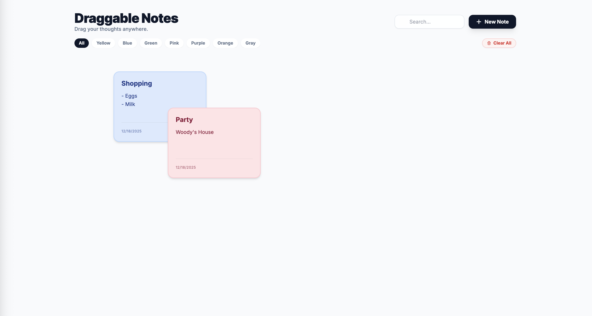
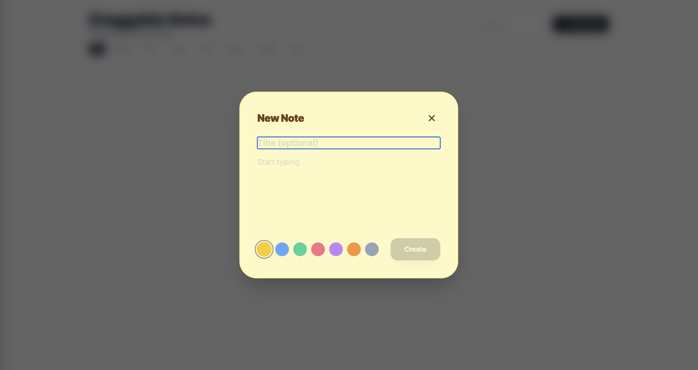
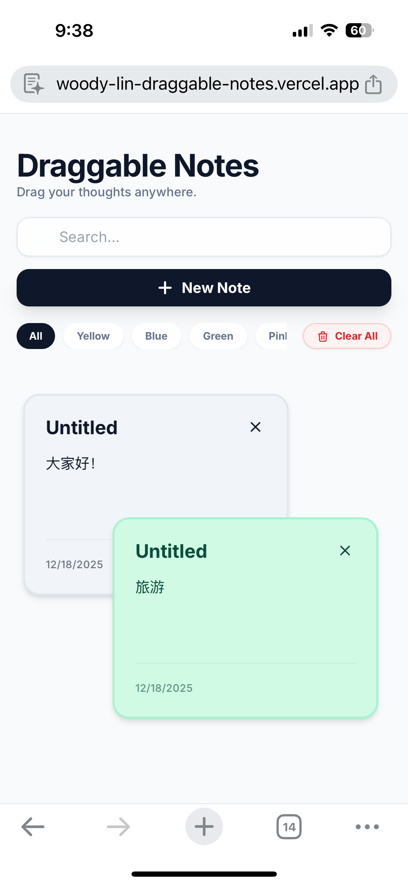

# Draggable Notes

A beautiful, interactive sticky notes application with drag-and-drop functionality and persistent storage per browser. In mobile browser, long press the note to drag it!

## How to Use

- Create a Note: Click the "New Note" button in the top right
- Add Content: Enter a title (optional) and your note content
- Choose a Color: Select from the color palette
- Drag Notes: Click and drag (or long-press on mobile) to move notes around
- Search: Use the search bar to find specific notes
- Filter: Click color tabs to filter notes by color
- Delete: Hover over a note and click the X button to remove it

## Technologies

- React 19
- TypeScript
- Tailwind CSS
- Vite
- Local Storage API
